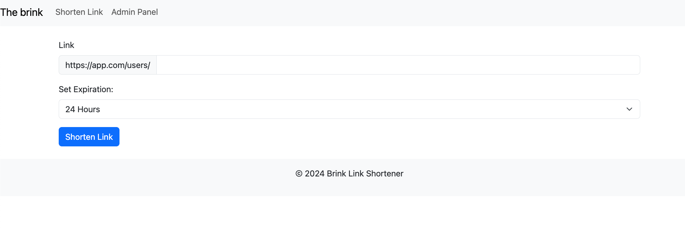

## Prerequisites
Install the following depending on your OS and preference (* required):

- **Docker** (latest versions are fine):
  - Git *
  - Docker *
  - Docker-compose *
  - Docker desktop
  - openssl

- **Standard** option:
  - PHP >= 8.2 *
  - Composer *
  - Git *
  - Apache/Nginx *
  - mysql 8.x * (or MariaDB OR Postgres)
  - PhpMyAdmin
  - openssl

## Installation
- Clone the project and navigate inside the directory.

- Copy `.env.exmaple`:
```bash
$ cp .env.exmaple .env
```

- Set local `.env ` variables:
```dotenv
DB_CONNECTION=mysql
## set it to `db` if you use docker
DB_HOST=localhost
DB_PORT=3306
DB_DATABASE=brink_url_shortner
DB_USERNAME=root
DB_PASSWORD=
DB_ROOT_PASSWORD=root
APP_RATE_LIMIT_PER_MIN=
```

- Install according to your preference:

  - **Docker**
    ```bash
    ## Navigate to your installation directory
    $ cd /WORKING_DIRECTORY/brink-url-shortner
    
    ## Building and Running the Docker Containers 
    $ docker compose build
    $ docker compose up -d
    
    ## Navigate to container terminal (Or via Docker desktop directly)
    $ docker ps
    $ docker exec -it <docker-cotainer-id> sh
    
    ## Check DB setup (DB should be created) / Migrations
    $ php artisan migrate
    ```

    - **Standard** (Double check `mysql`, `composer` and `php` installations and versions)
    ```bash
    ## Install packages
    $ composer install
    
    ## Check DB setup (DB should be created) / Migrations
    ## If issues faced check env variables/DB name...
    $ php artisan migrate
    
    ## Start local dev server:
    $ php artisan serve --port=8000
    ```

    ** You might want setting up the app on a web server, you can inspire from that [article](https://adeyomoladev.medium.com/how-to-deploy-a-laravel-app-using-apache-and-mysql-4910a07f9a0c)

## Usage
Navigate to the [shorten URL page](http://localhost:8000/urls), you should land on this page:


